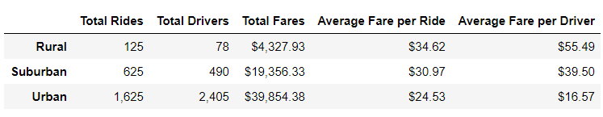
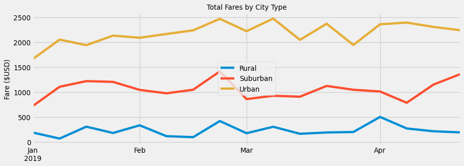

# PyBer Analysis 

## Project Overview
The purpose of this analysis is to understand the difference between ride-sharing data by city type, and clearly visualize the historical data, particularly from early 2019, in order to present V. Isualize with data for decision-makers to use as they adjust strategy. Analyzing the Rural and Suburban areas, we see that Rural and Suburban have significantly fewer available drivers, while at the same time are making more per ride and driver than Urban areas.


## Results of Pyber Analysis
Evaluating the ride-sharing data, we clearly see that Urban areas offer the most rides, drivers, and total fares. At the same time, average fare per ride and driver are lowest in Urban areas, which is to be expected due to the proximity of Urban locations.

 

---

## Summary of Analysis
Following the analysis, the line chart below give a sample of the findings that support the data in the image above. Given the results of the analysis, I recommended three changes to the current strategy.

*Redeploy some Urban drivers who live near suburban areas to cover those areas instead of urban areas. This will reduce the oversaturation in the urban areas and likely increaase revenue per ride and driver earnings. The suburban area is a high potential market that is under-served at the moment due to having just ~1/4 of the urban area drivers.

*Recruit more Rural drivers to better understand demand in those areas and potentially grow demand by offering more available rides. Because these rides offer the highest fares per ride and driver, increasing supply could generate demand or alternatively better serve an area that may already have high demand, but lacks drivers.

*Run a test using the above recommendations for 4 months, and analyze how the results compare to the line chart below. Ideally, we would like the moves of redploying some urban drivers to the suburbs and hiring more rural drivers to increase the rural and suburban lines (total fares by city type) without impacting the Urban areas or impacting the urban area to a lesser extent than the growth shown in rural and suburban areas.

*If the test fails, and urban areas are underserved and total fares declines too much, reallocate some drivers in the suburban area back to urban areas or increase recruitment in those areas if the growth in suburbs and rural looks promising but has yet to reach the believed potential.

 


```bash
Kyle Schneider, 9/20/2020
```
